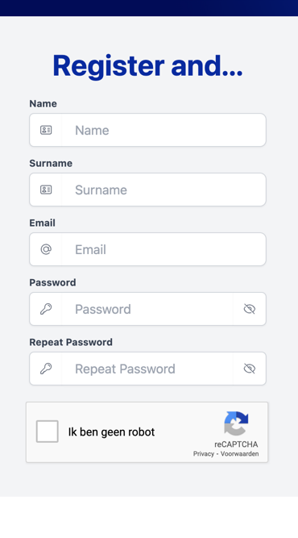
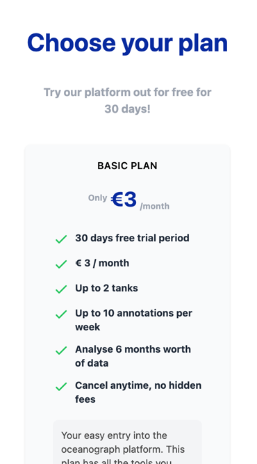

Visit [the register page](https://www.oceanograph.net/en/register) to create your account.
Follow the steps indicated on the screen. They will guide you through your journey to using the
Oceanograph platform.

First, provide your personal details to create an account at oceanograph. We highly value
your privacy and none of your details will be shared with third parties, unless specified otherwise.

Choose the plan that best suites for you. At this time, oceanograph offers 2 plans: Basic and Pro.
Each plan aims to provide the best tool for reef keeping for respectively, the beginning reefer or the experienced reefer.

Your account includes **a free 30 days trial period**. You will not be charged for the use of the platform
during this time period. If you cancel your subscription in your [account settings](https://wwww.oceanogaph.net/account), 
you will not be billed for your trial period. If you do not cancel your subscription, your subscription will become active
and you will be billed for the continued use of the platform.

> See [Plans](/account/plans)