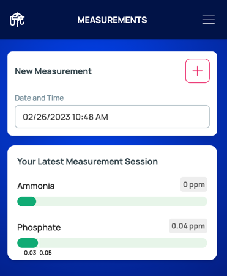
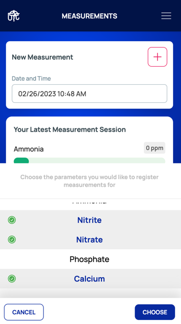

On the [measurements](https://www.oceanograph.net/measurements) page, select the reef tank you wish to
add test results (commonly referred to as measurements) to in the menu.

> The water test results you last recoded will appear on this page as well, if any

Then, press the plus icon under 'New Measurement' to select which parameter you would like to record test results for.
Optionally another date then the current date can be chosen for the measurement you are about to record.

Once you have entered your test results, press the 'Save Measurements' button. The platform will immediately
give you feedback as to whether these water values fall within an acceptable range for optimal health of your reef tank's
[ecosystem](/glossary#ecosystem).

:tada: Congratulations! You have now setup your first tank and registered your first water test results! You may know wish to:
- Visit your [Dashboard](/dashboard) to consult the overview of your tank
- [Analyse](/analytics) the history of your tank
- ...